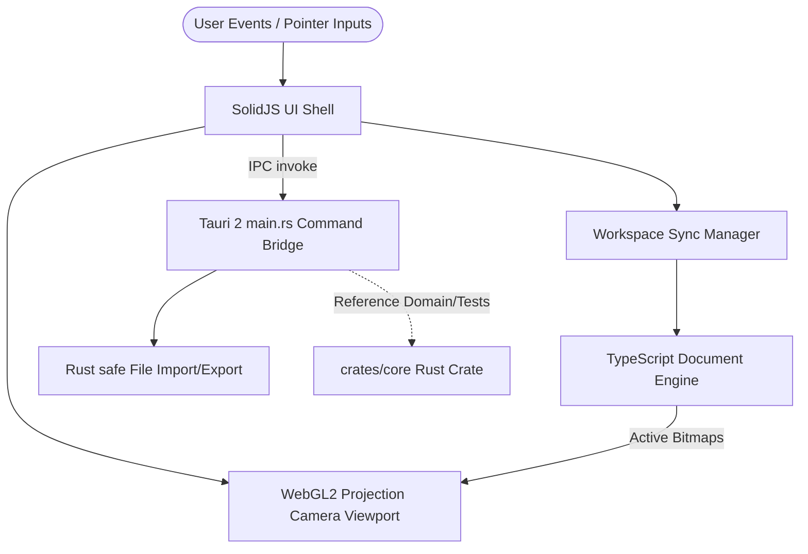

<p align="center">
  <strong>Photrez</strong>
</p>

<p align="center">
  A precise, lightweight desktop image editor built for practical image work.
</p>

<p align="center">
  <a href="https://github.com/rahmanqolbi/photrez/actions/workflows/ci.yml"></a>
  <a href="https://github.com/rahmanqolbi/photrez/blob/main/LICENSE"></a>
  <a href="https://github.com/rahmanqolbi/photrez/stargazers"></a>
  <a href="https://github.com/rahmanqolbi/photrez/issues"></a>
  
  
</p>

---

Photrez is an open-source desktop image editor with a compact, familiar workflow: layers, selection, transform, crop, brush, eraser, export, history, and a WebGL2 canvas. It is built with Tauri, SolidJS, TypeScript, and Rust.

Photrez is currently **pre-release software**. The editor is usable in development, but APIs, document internals, and UI details may change before the first stable release.

## Why Photrez

- **Lightweight desktop feel:** Tauri shell, compact editor chrome, and a tool-first workflow.
- **Practical editing core:** Layers, transforms, crop, brush, eraser, color, export, and history.
- **Fast feedback loop:** Focused unit, component, pointer-chain, browser, and Rust tests.
- **Clear boundaries:** SolidJS owns UI, TypeScript owns the current MVP document engine, WebGL2 owns active rendering, and Rust crates track core domain work.
- **Open-source first:** Public contribution, security, governance, issue, and pull request docs are included.

## Current Capabilities

| Area | Status |
| --- | --- |
| Desktop shell | Custom title bar, menus, dialogs, native window actions, file open/export |
| Workspace | Multi-document tabs, drag and drop, cross-document layer movement |
| Layers | Add, duplicate, delete, reorder, opacity, visibility, lock, merge down, flatten |
| Selection | Rectangle selection, inverted selection, cut/copy/paste/delete |
| Transform | Move, scale, rotate, flip, snapping, keyboard nudges |
| Crop and resize | Classic and modern crop modes, canvas expansion, resize dialog |
| Paint | Brush and eraser with calibrated round-tip hardness, flow, smoothing, presets |
| Export | PNG, JPEG, and WebP |
| Testing | Frontend, Rust, browser, export, dialog, pointer-chain, and paint regression coverage |

## Tech Stack

- **Desktop:** Tauri 2
- **Frontend:** SolidJS, TypeScript, Vite
- **Styling:** Tailwind CSS v4
- **Renderer:** WebGL2 for the current MVP runtime
- **Core:** TypeScript `DocumentEngine` for the current editor hot path
- **Rust:** `photrez-core` and `photrez-render` crates

## Runtime Architecture

Below is the active runtime data flow mapping user input, frontend rendering, and desktop backend coordination:



## Getting Started

### Requirements

- Node.js
- pnpm
- Rust stable toolchain
- Tauri platform prerequisites for your OS

### Install

```bash
pnpm install
```

### Run the desktop app

```bash
pnpm dev
```

### Build

```bash
pnpm build
```

### Verify

```bash
pnpm run verify
```

Focused checks:

```bash
pnpm --filter photrez-desktop test --run
pnpm run build
cargo test -p photrez-core
cargo test --workspace
```

## Repository Layout

```text
apps/desktop/       Tauri desktop app and SolidJS editor UI
crates/core/        Rust core domain model and tests
crates/render/      Future Rust renderer crate
docs/spec/          Product and technical specifications
docs/reference/     Runtime contracts, shortcuts, file formats, and inventories
docs/decisions/     Architecture and project decision records
docs/ARCHITECTURE.md
docs/FEATURES.md
docs/DESIGN.md      Visual design system
docs/PRODUCT.md     Product context
```

## Documentation

- [Architecture](docs/ARCHITECTURE.md)
- [Feature Status](docs/FEATURES.md)
- [Product Scope](docs/spec/product-scope.md)
- [Product Requirements](docs/spec/prd.md)
- [Technical Requirements](docs/spec/trd.md)
- [Command Contract](docs/reference/command-contract-spec.md)
- [Keyboard Shortcuts](docs/reference/keyboard-shortcut-map.md)
- [File Format Support](docs/reference/file-format-support.md)
- [Design System](docs/DESIGN.md)
- [Contributing](CONTRIBUTING.md)
- [Security Policy](SECURITY.md)

## Roadmap

Near-term work is focused on:

- Public README screenshots and release notes.
- First-run and empty workspace polish.
- Native runtime smoke evidence.
- UI cleanup for placeholder-looking surfaces.
- Continued test coverage around real user wiring paths.

See [Feature Status](docs/FEATURES.md) for the current implementation map.

## Contributing

Photrez welcomes careful, scoped contributions. Good first contributions include documentation cleanup, reproducible bug reports, focused tests, accessibility fixes, and small UI polish that preserves the existing editor layout.

Please read [CONTRIBUTING.md](CONTRIBUTING.md) before opening a pull request.

## Security

Please report security issues privately before public disclosure. See [SECURITY.md](SECURITY.md).

## License

Photrez is licensed under AGPL-3.0-or-later. See [LICENSE](LICENSE) and [NOTICE](NOTICE).
