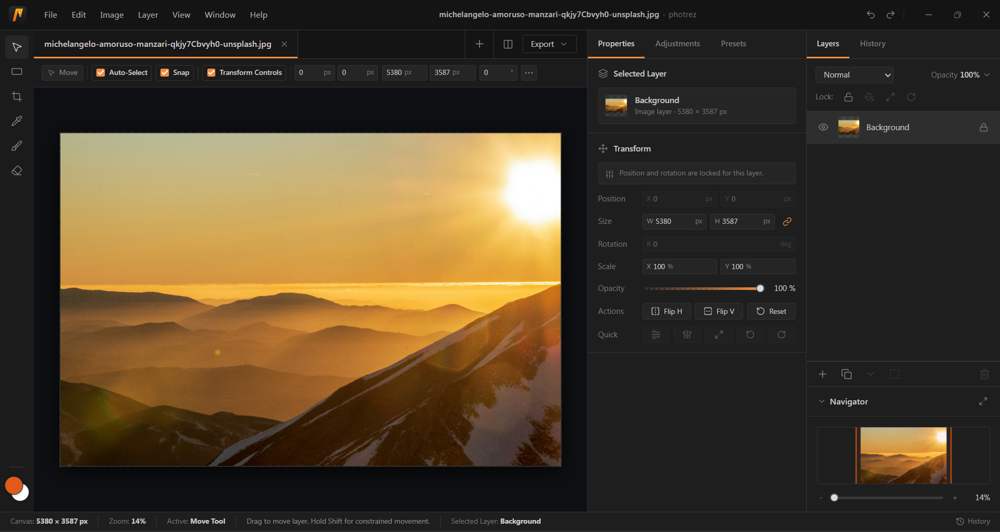
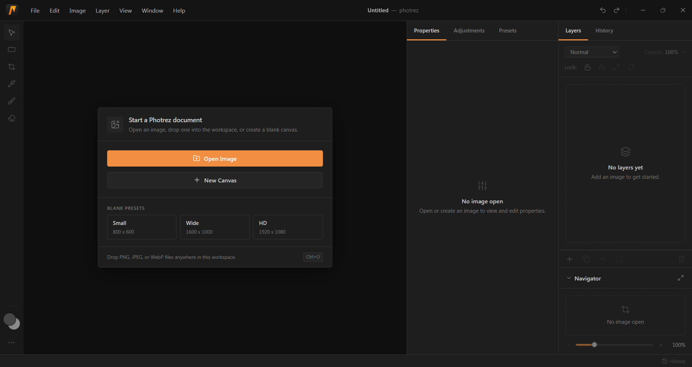
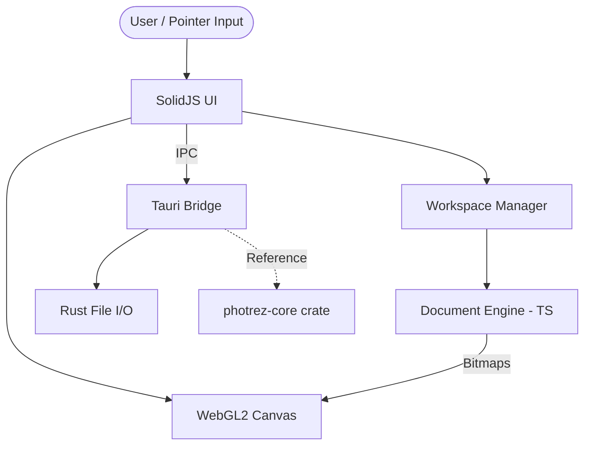

<p align="center">
  
</p>

<h1 align="center">
  <strong>Photrez</strong>
</h1>

<p align="center">
  A small, lightweight desktop image editor for everyday image work.
</p>

<p align="center">
  <a href="https://github.com/rahmanqolbi/photrez/actions/workflows/ci.yml"></a>
  <a href="https://github.com/rahmanqolbi/photrez/blob/main/LICENSE"></a>
  <a href="https://github.com/rahmanqolbi/photrez/stargazers"></a>
  <a href="https://github.com/rahmanqolbi/photrez/issues"></a>
  
  
</p>

---

> **Note:** Photrez is a small open-source project. It started as a focused attempt to build a fast, no-nonsense desktop image editor without the bloat. If you find it useful or just want to poke around the code, welcome! Bug reports and small contributions are appreciated.

Photrez is an open-source desktop image editor with a compact, familiar workflow: layers, selection, transform, crop, brush, eraser, export, history, and a WebGL2 canvas. It is built with Tauri, SolidJS, TypeScript, and Rust (for future core compute).

Photrez is currently in **alpha** (`v0.1.0-alpha.1`). The editor is usable, but expect bugs, breaking changes, and incomplete features. Not recommended for production use.

- **Supported platform:** Windows 10/11 (macOS/Linux planned for beta)
- **Known issues:** See [KNOWN_ISSUES.md](KNOWN_ISSUES.md)
- **Bug reports:** [GitHub Issues](https://github.com/rahmanqolbi/photrez/issues)
- **Security:** See [SECURITY.md](SECURITY.md)

## Why Photrez

A few things we care about:

- **Lightweight desktop feel:** a Tauri shell, compact editor chrome, and a tool-first workflow.
- **Practical editing core:** layers, transforms, crop, brush, eraser, color, export, and history.
- **Fast feedback loop:** focused unit, component, pointer-chain, browser, and Rust tests.
- **Clear boundaries:** SolidJS owns the UI, TypeScript owns the current MVP document engine, WebGL2 owns active rendering, and the Rust crates track core domain work.
- **Open-source first:** public contribution, security, governance, issue, and pull request docs are all included.

## Screenshots


*Main editor workspace showing an open document with the transform options, layers list, and navigator*


*Start screen showing the document creation dialog and empty workspace*

## Current Capabilities

| Area | Status |
| --- | --- |
| Desktop shell | Custom title bar, menus, dialogs, native window actions, file open/export |
| Workspace | Multi-document tabs, drag and drop, cross-document layer movement |
| Layers | Add, duplicate, delete, reorder, opacity, visibility, lock, merge down, flatten |
| Selection | Rectangle selection, inverted selection, cut/copy/paste/delete |
| Transform | Move, scale, rotate, flip, snapping, keyboard nudges |
| Crop and resize | Classic and modern crop modes, canvas expansion, resize dialog |
| Paint | Brush and eraser with calibrated round-tip hardness, flow, smoothing, presets |
| Export | PNG, JPEG, and WebP |
| Testing | Frontend, Rust, browser, export, dialog, pointer-chain, and paint regression coverage |

## Tech Stack

- **Desktop:** Tauri 2
- **Frontend:** SolidJS, TypeScript, Vite
- **Styling:** Tailwind CSS v4
- **Renderer:** WebGL2 for the current MVP runtime
- **Core:** TypeScript `DocumentEngine` for the current editor hot path
- **Rust (future):** `photrez-core` domain crate (WASM compile target)

## Runtime Architecture

Here is how the pieces talk to each other at runtime:



## Getting Started

### Requirements

- **Bun 1.3.14** (from [bun.com](https://bun.com)) — the repo pins it via `packageManager`, so `bun install` uses the matching version
- **Rust** stable toolchain (via [rustup](https://rustup.rs))
- **Tauri 2 prerequisites** for your OS: <https://v2.tauri.app/start/prerequisites/>
- **System WebView** (Windows: WebView2; macOS: Cocoa; Linux: webkit2gtk) — required by the Tauri shell

### Install

```bash
bun install
```

### Run the desktop app

```bash
bun run tauri dev
```

### Build

```bash
bun run build
```

### Verify

```bash
bun run verify
```

Focused checks:

```bash
bun run --filter photrez-desktop test --run
bun run build
cargo test -p photrez-core
cargo test --workspace
```

## Repository Layout

```text
apps/desktop/       Tauri desktop app and SolidJS editor UI
crates/core/        Rust core domain model and tests (WASM compile target)
docs/spec/          Product and technical specifications
docs/reference/     Runtime contracts, shortcuts, file formats, and inventories
docs/ARCHITECTURE.md
docs/FEATURES.md
docs/DESIGN.md      Visual design system
docs/PRODUCT.md     Product context
```

## Documentation

- [Known Issues (Alpha)](KNOWN_ISSUES.md)
- [Architecture](docs/ARCHITECTURE.md)
- [Feature Status](docs/FEATURES.md)
- [Product Scope](docs/spec/product-scope.md)
- [Product Requirements](docs/spec/prd.md)
- [Technical Requirements](docs/spec/trd.md)
- [Command Contract](docs/reference/command-contract-spec.md)
- [Keyboard Shortcuts](docs/reference/keyboard-shortcut-map.md)
- [File Format Support](docs/reference/file-format-support.md)
- [Design System](docs/DESIGN.md)
- [Contributing](CONTRIBUTING.md)
- [Security Policy](SECURITY.md)

## Roadmap

Near-term work is focused on:

- First-run and empty workspace polish.
- Native runtime smoke evidence.
- UI cleanup for placeholder-looking surfaces.
- Continued test coverage around real user wiring paths.
- Release notes and packaging polish.

See [Feature Status](docs/FEATURES.md) for the current implementation map.

## Contributing

Photrez welcomes careful, scoped contributions. Good first contributions include documentation cleanup, reproducible bug reports, focused tests, accessibility fixes, and small UI polish that preserves the existing editor layout.

Please read [CONTRIBUTING.md](CONTRIBUTING.md) before opening a pull request.

## Security

Please report security issues privately before public disclosure. See [SECURITY.md](SECURITY.md).

## License

Photrez is licensed under AGPL-3.0-or-later. See [LICENSE](LICENSE) and [NOTICE](NOTICE).
