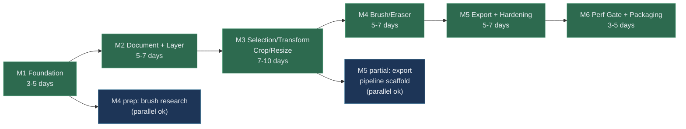

# 07 - Build Plan (MVP)

## Milestone Dependency Graph

## Critical Path

The critical path runs through: **M1 → M2 → M3 → M4 → M5 → M6**.

All milestones on this path are sequential blockers. The total estimated duration
on the critical path is **28–41 working days** (approximately 6–9 weeks).

## Parallel Work Opportunities

| Window | Parallelizable Work | Dependency |
| --- | --- | --- |
| During M2 | Brush engine research and prototype (isolated crate) | Does not depend on document model API being stable |
| During M3 | Export pipeline scaffold and encoder wiring (isolated crate) | Does not depend on selection/transform APIs |
| During M4–M5 | CI hardening and perf measurement tooling | Infrastructure work, not feature-dependent |

Exploiting parallel tracks can reduce the effective timeline by approximately **5–10 days**.

## Total Estimated Timeline

| Scenario | Duration | Conditions |
| --- | --- | --- |
| Sequential only | 28–41 working days | No parallel work, single contributor |
| With parallel tracks | 23–33 working days | Parallel prep tasks utilized |
| Aggressive | 20–28 working days | Experienced contributor, minimal blockers |

---

## Milestone 1 - Foundation

Estimated effort: `3-5 days`

- Initialize Tauri shell.
- Establish core module skeleton.
- Establish renderer module skeleton.
- Wire minimal command bridge.

Definition of done:

- App boots under budget target envelope baseline measurement recorded.

Detailed execution plan: `docs/08-milestone-1-execution.md`.

## Milestone 2 - Document and Layer Core

Estimated effort: `5-7 days`

Dependencies: M1 complete (shell + core skeleton + command bridge working).

- Implement document model per `docs/04-erd-or-data-model.md`.
- Implement layer basic operations (add/delete/reorder/opacity).
- Implement undo/redo stack (50-step depth).
- Add unit tests for layer workflows.
- Add contract tests for layer-related commands.

Definition of done:

- Layer CRUD + reorder + opacity pass tests.
- Undo/redo works for layer operations.
- Document model serialization baseline verified.

## Milestone 3 - Selection/Move/Transform + Crop/Resize

Estimated effort: `7-10 days`

Dependencies: M2 complete (document model + layer operations stable).

- Implement selection and move flows.
- Implement basic transform (scale/rotate/flip).
- Implement crop and resize paths.
- Add unit tests and contract tests for all operations.
- Add failure-path tests for bounds validation.

Definition of done:

- Core image-manipulation workflows pass unit/contract tests.
- Invalid bounds and dimensions are rejected with deterministic errors.

## Milestone 4 - Brush/Eraser

Estimated effort: `5-7 days`

Dependencies: M3 complete (layer pixel manipulation paths working).

- Implement brush engine baseline.
- Implement eraser behavior baseline.
- Wire stroke commands through command contract.
- Add stroke-related tests.
- Add renderer smoke tests for stroke drawing.

Definition of done:

- Brush/Eraser stable on target baseline scenarios.
- Stroke latency acceptable on baseline device.

## Milestone 5 - Export + Hardening

Estimated effort: `5-7 days`

Dependencies: M4 complete (all editing features functional).

- Implement JPG/PNG/WebP export pipeline.
- Validate quality settings and dimension handling.
- Add failure-path tests for I/O errors and invalid parameters.
- Add contract tests for export command responses.
- Harden error handling across all milestone features.

Definition of done:

- Export reliability and output checks pass.
- Export success rate `>= 99%` on fixture test set.

## Milestone 6 - Perf Gate + Packaging

Estimated effort: `3-5 days`

Dependencies: M5 complete (all features implemented and tested).

- Measure installer size.
- Measure idle RAM.
- Measure startup time.
- Optimize until budget met.
- Package release candidate.

Definition of done:

- Installer `< 80 MB`, idle RAM `< 250 MB`, startup `< 2s`.
- Performance evidence recorded per `docs/16-performance-measurement-protocol.md`.
- Release candidate artifact produced.

## Risk Factors Affecting Timeline

| Factor | Impact | Mitigation |
| --- | --- | --- |
| wgpu compatibility on target hardware | May extend M1/M4 | Early smoke tests, fallback renderer research |
| Brush performance on low-end devices | May extend M4 | Keep first implementation simple, benchmark early |
| Scope creep requests during execution | May extend any milestone | Enforce `AGENTS.md` scope guard |
| Dependency build issues (Tauri/wgpu) | May extend M1 | Pin dependency versions, test in CI early |

See `docs/13-risk-register.md` for full risk tracking.
