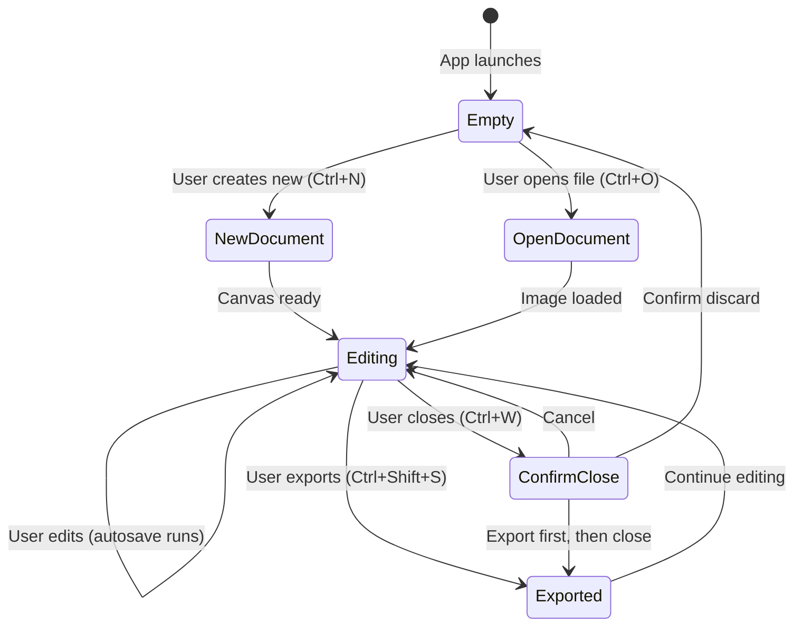

# 34 - Save and Document Lifecycle (MVP)

This document clarifies how save, autosave, new document, and document lifecycle work in MVP.

## 1) Document Lifecycle Overview

## 2) New Document Flow

### Trigger

- Menu: `File > New`
- Shortcut: `Ctrl+N`

### Dialog Fields

| Field | Type | Default | Constraints |
| --- | --- | --- | --- |
| Width | Number input (px) | `1920` | `1..16384` |
| Height | Number input (px) | `1080` | `1..16384` |
| Background | Color picker or preset | White (`#FFFFFF`) | White, Black, Transparent |

### Preset Sizes (Optional MVP)

| Preset | Width | Height | Use Case |
| --- | --- | --- | --- |
| HD | 1920 | 1080 | General purpose |
| Social Square | 1080 | 1080 | Instagram / social media |
| A4 at 300 DPI | 2480 | 3508 | Print |
| Custom | User input | User input | — |

### Behavior

1. User fills in dimensions and background.
2. Core creates document with one background layer.
3. Canvas viewport centers on new document.
4. Layer panel shows single background layer.
5. Status bar shows document dimensions.

### Validation

- `width * height * 4` must not exceed `MAX_PIXEL_BUDGET` (256 MB).
- Invalid dimensions return `E_VALIDATION`.

## 3) Open File Flow

Defined in `docs/27-key-user-flows.md` (Flow A).

Additional specifications:

- Supported formats: see `docs/33-file-format-support.md`.
- Multi-document workspace recovery spec: see `docs/superpowers/specs/2026-05-29-multi-document-workspace-design.md`.
- Opening one image creates one document tab.
- Opening multiple images creates one document tab per valid image.
- If a document is already open, opening more images does not replace it; the new images open as additional document tabs.
- Drag/drop file input follows the same rule: open as new document tabs in MVP.
- The active document is the export/edit target.

## 4) Save Strategy (MVP)

### Key Decision: MVP has Export-only workflow

In MVP, there is **no native project format save**. The workflow is:

- **Autosave**: automatic crash recovery (not user-facing).
- **Export**: user-facing output to JPG/PNG/WebP.

This decision is consistent with:
- `docs/00-product-scope.md` — native project format is a non-goal.
- `docs/04-erd-or-data-model.md` section 7 — future project format is post-MVP.

### What "Save" (Ctrl+S) Does in MVP

**Decision: Ctrl+S always triggers the Export Dialog** (same as Ctrl+Shift+S).
This prevents accidental file overwriting since the MVP works in an export-only layout (no project format).

### Autosave Behavior

Per `docs/04-erd-or-data-model.md` section 7:

- Autosave runs max once per 60 seconds during active editing.
- Writes metadata (JSON) + pixel data (binary) to temp directory.
- On crash recovery: app checks for autosave at startup.
- Autosave files cleaned up on normal document close.
- Autosave is **not** user-facing (no "recover from autosave" UI in MVP).

## 5) Close Document Flow

### Trigger

- Menu: `File > Close`
- Shortcut: `Ctrl+W`
- Window close button

### Behavior

1. If document has unsaved changes (any edit after last export):
   - Show confirmation dialog: `Discard changes?`
   - Options: `Discard` | `Cancel`
2. If no unsaved changes:
   - Close document immediately.
   - If other tabs remain, activate the nearest document tab.
   - If the last tab was closed, return to the minimal empty state.

### Dirty State Tracking

- Document is "dirty" if any edit has been made since last export.
- Undo back to clean state clears dirty flag.
- Export clears dirty flag.

## 6) Error Cases

| Scenario | Error Code | User Message |
| --- | --- | --- |
| New doc dimensions too large | `E_RESOURCE_LIMIT` | `Canvas size exceeds maximum. Try smaller dimensions.` |
| Open file format unsupported | `E_VALIDATION` | `Cannot open selected file. Please choose a valid image format.` |
| Open file corrupted | `E_VALIDATION` | `File appears to be damaged. Try a different file.` |
| Open file too large | `E_RESOURCE_LIMIT` | `Image exceeds maximum size. Try a smaller image.` |
| Export write failed | `E_IO` | `Cannot save file. Check destination path and try again.` |
| Autosave write failed | Internal log only | No user-facing error (silent fallback) |

## 7) Open Questions

- [x] **Multiple documents**: MVP recovery uses document tabs. See `docs/superpowers/specs/2026-05-29-multi-document-workspace-design.md`.
- [x] **Recent files list**: Not in MVP. Empty state remains minimal and canvas-centered.

## 8) Change Control

- Save strategy changes require update to:
  1. This document.
  2. `docs/01-id-decision-log.md`.
  3. `docs/27-key-user-flows.md` (if flow changes).
  4. `docs/15-command-contract-spec.md` (if new commands needed).
