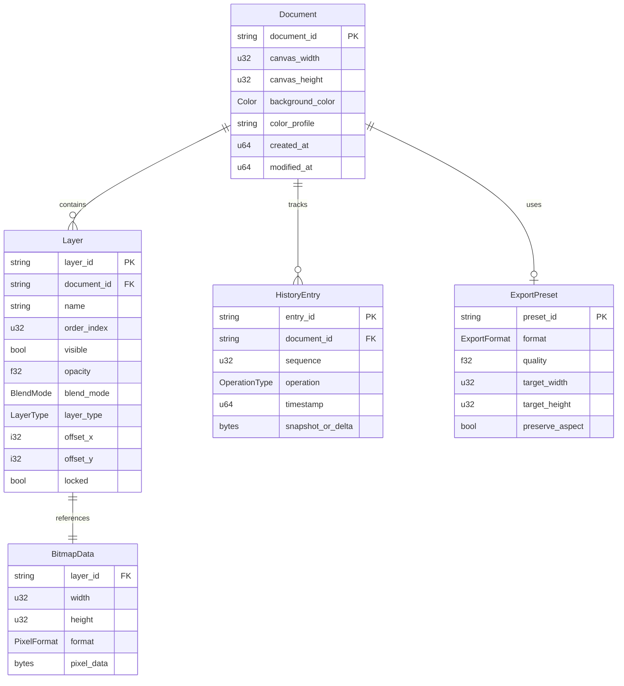

# 04 - Data Model (MVP)

This document defines the core data structures for the Photrez MVP.

A relational ERD is not required because the app is a local desktop editor
without complex multi-entity backend workflows. This file serves as the
authoritative schema reference for Rust core implementation.

## 1) Entity Relationships



## 2) Document Schema

| Field | Type | Constraints | Default | Notes |
| --- | --- | --- | --- | --- |
| `document_id` | `String (UUID v4)` | PK, immutable after creation | auto-generated | Unique per session |
| `canvas_width` | `u32` | `1..=16384` | `1920` | Max bound prevents OOM |
| `canvas_height` | `u32` | `1..=16384` | `1080` | Max bound prevents OOM |
| `background_color` | `Color (RGBA)` | each channel `0..=255` | `#FFFFFF` (white) | Transparent background uses alpha `0` |
| `color_profile` | `String (enum)` | `sRGB` only in MVP | `sRGB` | Locked per decision log |
| `layers` | `Vec<Layer>` | min 1 layer required | one background layer | Ordered by `order_index` |
| `history` | `Vec<HistoryEntry>` | max 50 entries | empty | Bounded per decision log |
| `created_at` | `u64 (Unix ms)` | immutable | current time | |
| `modified_at` | `u64 (Unix ms)` | updated on mutation | current time | |

### Document Invariants

- Canvas dimensions must satisfy: `width * height * 4 <= MAX_PIXEL_BUDGET`.
- `MAX_PIXEL_BUDGET` is `268_435_456` bytes (256 MB decoded RGBA) for MVP.
- At least one layer must exist at all times (background layer cannot be deleted).
- `modified_at` must be updated on every state mutation.

## 3) Layer Schema

| Field | Type | Constraints | Default | Notes |
| --- | --- | --- | --- | --- |
| `layer_id` | `String (UUID v4)` | PK, unique within document | auto-generated | |
| `name` | `String` | `1..=128` chars, non-empty | `Layer N` | Auto-increment N |
| `order_index` | `u32` | unique within document, `0..` | next available | 0 = bottom, higher = top |
| `visible` | `bool` | | `true` | Controls compositing inclusion |
| `opacity` | `f32` | `0.0..=1.0` | `1.0` | Applied during compositing |
| `blend_mode` | `BlendMode` | enum, see below | `Normal` | MVP may only implement `Normal` |
| `layer_type` | `LayerType` | enum, see below | `Raster` | MVP only supports `Raster` |
| `offset_x` | `i32` | unbounded (can be negative) | `0` | Layer position relative to canvas origin |
| `offset_y` | `i32` | unbounded (can be negative) | `0` | Layer position relative to canvas origin |
| `locked` | `bool` | | `false` | Prevents edits when true |
| `bitmap_ref` | `BitmapData` | required for raster layers | empty bitmap | See bitmap section |

### BlendMode Enum (MVP)

```rust
enum BlendMode {
    Normal,
    // Post-MVP: Multiply, Screen, Overlay, etc.
}
```

### LayerType Enum (MVP)

```rust
enum LayerType {
    Raster,
    // Post-MVP: Text, Shape, Adjustment, Group
}
```

### Layer Invariants

- `order_index` values must be contiguous within a document after reorder.
- `opacity` is clamped to `[0.0, 1.0]` at validation boundary.
- Locked layers reject mutation commands with `E_CONFLICT`.

## 4) Bitmap Data Schema

| Field | Type | Constraints | Default | Notes |
| --- | --- | --- | --- | --- |
| `layer_id` | `String` | FK to Layer | — | 1:1 relationship |
| `width` | `u32` | `1..=16384` | matches canvas | Bitmap dimensions |
| `height` | `u32` | `1..=16384` | matches canvas | Bitmap dimensions |
| `format` | `PixelFormat` | enum | `RGBA8` | See below |
| `pixel_data` | `Vec<u8>` | `len == width * height * bytes_per_pixel` | zeroed | Raw pixel buffer |

### PixelFormat Enum

```rust
enum PixelFormat {
    RGBA8,  // 4 bytes per pixel, sRGB, MVP default
    // Post-MVP: RGBA16, GrayscaleA8
}
```

### Bitmap Memory Budget

- Single layer max: `16384 * 16384 * 4 = 1 GB` (theoretical).
- Practical MVP guard: `width * height` must not exceed `67_108_864` pixels (256 MP).
- Combined document memory: sum of all layer bitmaps must not exceed `MAX_PIXEL_BUDGET`.
- Exceeding budget returns `E_RESOURCE_LIMIT`.

## 5) History Entry Schema

| Field | Type | Constraints | Default | Notes |
| --- | --- | --- | --- | --- |
| `entry_id` | `String (UUID v4)` | PK | auto-generated | |
| `document_id` | `String` | FK to Document | — | |
| `sequence` | `u32` | monotonic increasing | auto | Position in history stack |
| `operation` | `OperationType` | enum, see below | — | What was done |
| `timestamp` | `u64 (Unix ms)` | | current time | When it happened |
| `snapshot_or_delta` | `bytes` | | — | Undo data payload |

### OperationType Enum

```rust
enum OperationType {
    // Layer operations
    AddLayer,
    DeleteLayer,
    ReorderLayer,
    SetLayerOpacity,
    SetLayerVisibility,
    SetLayerLock,
    RenameLayer,

    // Canvas operations
    CropCanvas,
    ResizeCanvas,

    // Pixel operations
    BrushStroke,
    EraserStroke,

    // Transform operations
    MoveLayer,
    ScaleLayer,
    RotateLayer,
    FlipLayer,

    // Selection operations
    CreateSelection,
    MoveSelection,
    ClearSelection,
}
```

### History Strategy (MVP)

- **Approach**: snapshot-based (store full affected layer bitmap before mutation).
- **Max depth**: 50 entries (locked in decision log).
- **Eviction**: when stack exceeds 50, oldest entry is dropped (FIFO).
- **Redo branch**: on new mutation after undo, redo branch is discarded.
- **Memory pressure**: if total history memory exceeds budget, compress oldest entries or evict early with warning log.

### Undo/Redo Semantics

1. `undo`: restore previous snapshot, move current state to redo stack.
2. `redo`: restore next snapshot from redo stack, move current state to undo stack.
3. New mutation after undo: clears entire redo stack.
4. Empty undo/redo stack: command returns success with no-op (no error).

## 6) Export Preset Schema

| Field | Type | Constraints | Default | Notes |
| --- | --- | --- | --- | --- |
| `preset_id` | `String` | PK | auto-generated | |
| `format` | `ExportFormat` | enum | `PNG` | |
| `quality` | `f32` | `0.0..=1.0` | `0.85` | Only applies to JPG/WebP |
| `target_width` | `Option<u32>` | `1..=16384` or None | None (use doc size) | |
| `target_height` | `Option<u32>` | `1..=16384` or None | None (use doc size) | |
| `preserve_aspect` | `bool` | | `true` | When resizing on export |

### ExportFormat Enum

```rust
enum ExportFormat {
    JPG,
    PNG,
    WebP,
}
```

### Export Validation Rules

- `quality` is ignored for PNG (lossless).
- If only one dimension is set with `preserve_aspect = true`, other is computed.
- If both dimensions are set with `preserve_aspect = true`, fit-within strategy is used.
- Invalid combinations return `E_VALIDATION`.

## 7) Serialization Notes

### In-Memory Representation

- Document and layer metadata: Rust structs with `serde` derive.
- Pixel data: raw `Vec<u8>` buffers, not serialized with metadata.
- History snapshots: compressed pixel buffers (optional LZ4/zstd in later optimization).

### Autosave Strategy (MVP)

- Autosave is bounded: max one autosave per 60 seconds during active editing.
- Autosave writes metadata (JSON) + pixel data (raw binary) to temp directory.
- On crash recovery: app checks for autosave files at startup.
- Autosave files are cleaned up on normal document close.

### Future Project Format (Post-MVP)

- Native project format is explicitly out of MVP scope.
- Current persistence is autosave-only (not user-facing save/load of project files).
- Future format will likely be a container (ZIP-like) with JSON metadata + binary layers.

## 8) Memory Budget Summary

| Component | Budget | Notes |
| --- | --- | --- |
| Single layer bitmap | `<= 256 MP * 4 bytes` | Hard guard |
| Total document bitmaps | `<= 256 MB decoded` | `MAX_PIXEL_BUDGET` |
| History stack | `<= 50 snapshots` | Eviction on overflow |
| History memory | Monitor, no hard cap in MVP | Log warning at threshold |
| Idle app baseline | `< 250 MB total` | Per performance target |

## 9) Notes

- If later cloud sync or collaboration is added, upgrade this file to full ERD with versioning.
- All schema changes must be reflected in `docs/reference/command-contract-spec.md` if they affect IPC payloads.
- Enum expansions (blend modes, layer types, formats) require ADR if they affect MVP scope.
